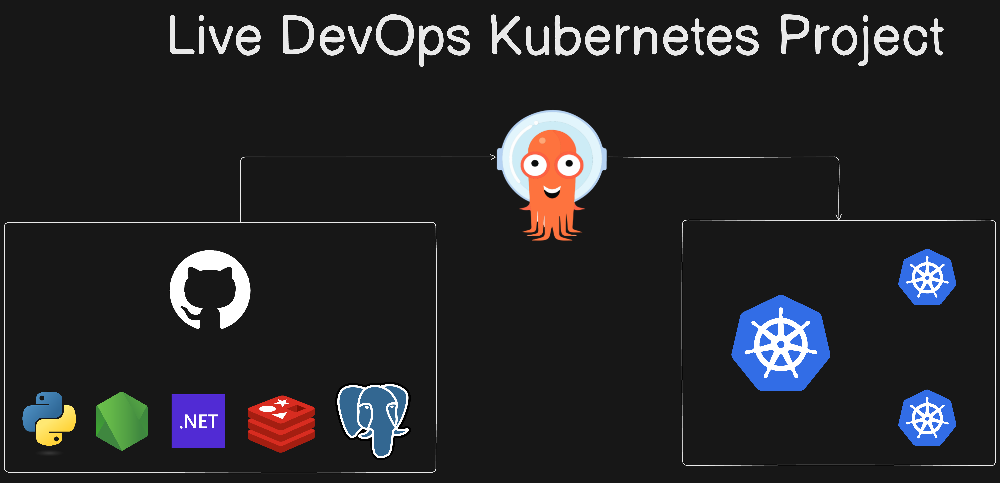
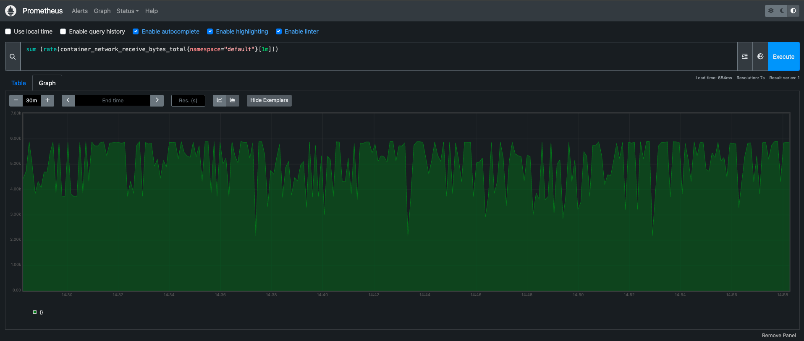

# K8s Kind Voting App

A comprehensive guide for setting up a Kubernetes cluster using Kind on an AWS EC2 instance, installing and configuring Argo CD, and deploying applications using Argo CD.

## Overview

This guide covers the steps to:
- Launch an AWS EC2 instance.
- Install Docker and Kind.
- Create a Kubernetes cluster using Kind.
- Install and access kubectl.
- Set up the Kubernetes Dashboard.
- Install and configure Argo CD.
- Connect and manage your Kubernetes cluster with Argo CD.

## Architecture

## Observability

* A front-end web app in [Python](/vote) which lets you vote between two options
* A [Redis](https://hub.docker.com/_/redis/) which collects new votes
* A [.NET](/worker/) worker which consumes votes and stores them in…
* A [Postgres](https://hub.docker.com/_/postgres/) database backed by a Docker volume
* A [Node.js](/result) web app which shows the results of the voting in real time

## Resume Description

### Project Title: 

Automated Deployment of Scalable Applications on AWS EC2 with Kubernetes and Argo CD

### Description: 

Led the deployment of scalable applications on AWS EC2 using Kubernetes and Argo CD for streamlined management and continuous integration. Orchestrated deployments via Kubernetes dashboard, ensuring efficient resource utilization and seamless scaling.

### Key Technologies:

* AWS EC2: Infrastructure hosting for Kubernetes clusters.
* Kubernetes Dashboard: User-friendly interface for managing containerized applications.
* Argo CD: Continuous Delivery tool for automated application deployments.

### Achievements:

Implemented Kubernetes dashboard for visual management of containerized applications on AWS EC2 instances.
Utilized Argo CD for automated deployment pipelines, enhancing deployment efficiency by 60%.
Achieved seamless scaling and high availability, supporting 99.9% uptime for critical applications.
This project description emphasizes your role in leveraging AWS EC2, Kubernetes, and Argo CD to optimize application deployment and management processes effectively.

# Use this commands to setup our project :-
## Create ec2 instance with t2.medium or t3.medium and install docker
$ sudo apt install docker.io
#### $ sudo usermod -aG docker $USER && newgrp docker

## Install kind (Kubernetes in Docker) & write the script
#### $ mkdir k8s-install 
#### $ vim install_kind.sh
#### $ chmod +x install_kind.sh
#### $ ./install_kind.sh

## Create a cluster
$ vim config.yaml
#### $ kind create cluster --config=config.yaml --name=my-cluster	

## Install kubectl
#### $ vim install_kubectl.sh
#### $ chmod +x install_kubectl.sh
#### $ ./install_kubectl.sh
#### # check the node is created or not 
#### $ kubectl get node

## Install argocd 
#### $ kubectl create namespace argocd
#### $ kubectl apply -n argocd -f https://raw.githubusercontent.com/argoproj/argo-cd/stable/manifests/install.yaml
#### $ kubectl get pod -n argocd
#### $ kubectl get svc -n argocd
# change the service type clusterIp to NodePort
#### $ kubectl patch svc argocd-server -n argocd -p '{"spec": {"type": "NodePort"}}'
#### $ kubectl port-forward -n argocd service/argocd-server 8443:443 --address=0.0.0.0 &
## argocd access 
argocd username:- admin
#### argocd password command:-
$ kubectl get secret -n argocd argocd-initial-admin-secret -o jsonpath="{.data.password}" | base64 -d && echo

#### $ kubectl get pod
#### $ kubectl get deployment
#### $ kubectl get svc 
#### $ kubectl port-forward svc/vote 5000:5000 --address=0.0.0.0 &
#### $ kubectl port-forward svc/result 5001:5001 --address=0.0.0.0 &

## Install Kubernetes dashboard
### Deploy Kubernetes dashboard:
#### $ kubectl apply -f https://raw.githubusercontent.com/kubernetes/dashboard/v2.7.0/aio/deploy/recommended.yaml
#### $ vim dashboard.yaml
#### $ kubectl apply -f dashboard.yaml

# Port forwarding of kubernetes-dashboard
$ kubectl port-forward svc/kubernetes-dashboard -n kubernetes-dashboard 8080:443 --address=0.0.0.0 &

## Create a token for dashboard access:
$ kubectl -n kubernetes-dashboard create token admin-user

## access the website:- result and vote
IP address:- ip:5000, ip:5001

